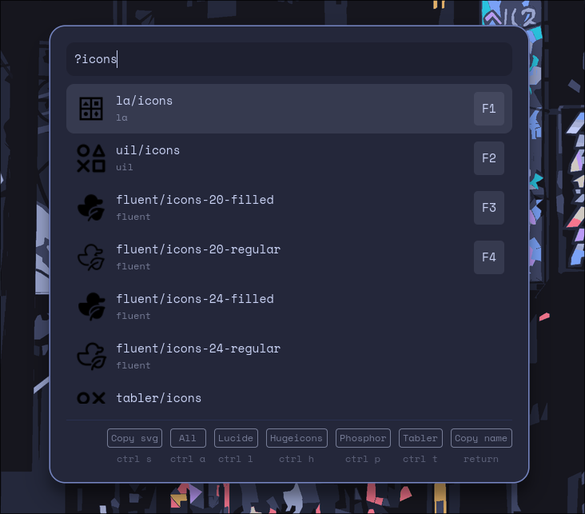

# Elephant Iconify

Custom [Elephant](https://github.com/abenz1267/elephant) menu to browse [Iconify](https://iconify.design/) icons in [Walker Launcher](https://github.com/abenz1267/walker).

Browse popular icon libraries like [Lucide](https://lucide.dev/), [Hugeicons](https://hugeicons.com/), and [Phosphor Icons](https://phosphoricons.com/) without opening a web browser.



## Prerequisites

- [Walker](https://github.com/abenz1267/walker)
- [Elephant](https://github.com/abenz1267/elephant) with `menus` provider
- [curl](https://curl.se/) for fetching icons

> [!TIP]
> On Arch run `paru -S elephant-menus-bin` to install the `menus` provider.

## Installation

```bash
git clone https://github.com/nino-mau/elephant-iconify
cd elephant-iconify
./install.sh
```

The install script will:

1. Check for required dependencies (curl)
2. Copy the menu to `~/.config/elephant/menus/`
3. Append action keybindings to your walker config (`~/.config/walker/config.toml`)

## Setup

After installation, configure a prefix to trigger the custom menu in your walker config:

```toml
[[providers.prefixes]]
prefix = "?"
provider = "menus:iconify"
```

Then restart walker & elephant.

## Usage

Type to search icons. By default, only Lucide and Hugeicons collections are searched for better performance.

**Special search syntax:**

- Use `/` to search specific collections: `collection/query` (e.g., `phosphor/arrow`)
- Toggle "Search All" with `Ctrl+A` to search across all Iconify collections

**Caching:**

SVG icons are downloaded and cached in `~/.cache/elephant/iconify/` on first use for faster subsequent loads.

> [!WARNING]
> Searching all collections may be slower since icons are fetched on demand.

## Actions

| Key      | Action                                                                 | Type        |
| -------- | ---------------------------------------------------------------------- | ----------- |
| `Enter`  | Copy icon name to clipboard (e.g., `lucide:search`)                    | Action      |
| `Ctrl+S` | Copy icon as SVG code                                                  | Action      |
| `Ctrl+A` | Show icons from all collections                                        | Mode Toggle |
| `Ctrl+L` | Show icons only from [Lucide](https://lucide.dev/) collection          | Mode Toggle |
| `Ctrl+H` | Show icons only from [Hugeicons](https://hugeicons.com/) collection    | Mode Toggle |
| `Ctrl+P` | Show icons only from [Phosphor](https://phosphoricons.com/) collection | Mode Toggle |
| `Ctrl+T` | Show icons only from [Tabler](https://tabler.io/icons) collection      | Mode Toggle |

> [!TIP]
> Only one "mode" can be active at the same time, toggling one disable the other

## Configuration

Edit `~/.config/elephant/menus/iconify.lua` to customize:

```lua
-- Number of icons fetched per search
local ICONIFY_API_SEARCH_LIMIT = 64

-- Collections searchable by default
local DEFAULT_COLLECTIONS = { "lucide", "hugeicons" }
```
